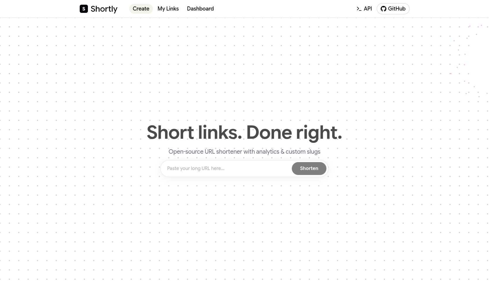

# Shortly

A self-hosted, open-source URL shortener built with Go (Gin) + React (Vite).



## Architecture

```
┌─────────────┐       ┌──────────────┐       ┌───────────┐
│  React/Vite  │  ──►  │  Gin (Go)   │  ──►  │ SQLite or │
│  Frontend    │  API  │  Backend    │  DB   │ Postgres  │
│  :5173       │  ◄──  │  :8080      │  ◄──  │           │
└─────────────┘       └──────────────┘       └───────────┘
```

The backend follows a **handler → service → repository** layering — handlers parse requests, services hold business rules, and repositories abstract the database (interface with SQLite and PostgreSQL implementations).

### Key design decisions

- **Pluggable database** — SQLite (zero config) or PostgreSQL, selected via `DB_DRIVER` at startup
- **No authentication** — intentionally open for self-hosted simplicity; put behind a reverse proxy for public deployments
- **Click counting** — atomic increment on every redirect, no separate analytics pipeline
- **Rate limiting** — per-IP in-memory token buckets (2 req/s burst 10 for API, 20 req/s burst 40 for redirects)
- **Self-redirect loop prevention** — URLs whose host matches `BASE_URL` are rejected

### Data flow

```
Creating a link:             Redirect:
User URL → POST /api/links   Browser → GET /:code
  → validate JSON              → look up code (404/410)
  → validate URL               → increment clicks atomically
  → generate 6-char base62     → 302 to original_url
  → INSERT row
  → return { code, short_url, original_url, created_at }
```

## Features

- **Link shortening** — Create short, memorable aliases for long URLs
- **Pluggable database** — Supports PostgreSQL and SQLite out of the box
- **Redirect tracking** — Count clicks and see when a link was last used
- **Expiration support** — Set a TTL on links so they auto-expire
- **REST API** — All functionality exposed via a clean JSON API
- **Vite-powered UI** — Modern React frontend with hot module reload and TanStack Query
- **Single-command dev** — `bun run dev` starts both servers concurrently

## Tech stack

| Layer | Tool |
|-------|------|
| Backend | Go + Gin |
| Frontend | React 19 + Vite 8 + React Router 7 + TanStack React Query 5 |
| Database | PostgreSQL / SQLite (configurable) |
| Dev runner | concurrently |

## Getting started

### Prerequisites

- Go 1.21+
- Node.js 18+
- PostgreSQL (optional — SQLite works without any setup)

### 1. Clone and install

```bash
git clone https://github.com/your-org/shortly.git
cd shortly

# Install all dependencies (root + frontend)
bun install
bun install --cwd frontend
```

### 2. Configure the database

Copy `.env.example` to `.env` and set your database choice:

```env
DB_DRIVER=sqlite     # or "postgres"
DB_DSN=shortly.db    # SQLite file path, or Postgres DSN, e.g. "host=localhost user=postgres password=... dbname=shortly port=5432 sslmode=disable"
```

SQLite is the default and requires zero setup.

### 3. Run

```bash
bun run dev
```

This starts:

- Go backend on **http://localhost:8080**
- Vite frontend on **http://localhost:5173** (API calls are proxied to `:8080`)

### Run separately

```bash
bun run dev:backend   # Go server only
bun run dev:frontend  # Vite dev server only
```

## API

| Method | Path | Description |
|--------|------|-------------|
| `POST` | `/api/links` | Create a short link |
| `GET` | `/api/links?limit=&offset=` | List links (paginated) |
| `GET` | `/api/links/:id` | Get link details |
| `DELETE` | `/api/links/:id` | Delete a link |
| `GET` | `/api/stats` | Dashboard stats |
| `GET` | `/:code` | Redirect (302) to the original URL |

## Repo structure

```
shortly/
├── backend/
│   ├── cmd/server/main.go       # Entry point
│   ├── internal/
│   │   ├── config/              # Env-based config
│   │   ├── db/                  # DB connection + migration runner
│   │   ├── model/               # Shared structs
│   │   ├── repository/          # Interface + implementations
│   │   ├── service/             # Business logic
│   │   ├── handler/             # HTTP handlers
│   │   └── middleware/          # Rate limiter
│   ├── migrations/              # SQL per driver
│   └── .env.example
├── frontend/
│   ├── src/
│   │   ├── components/          # Reusable UI
│   │   ├── pages/               # Route-level pages
│   │   └── lib/                 # API client, query client
│   ├── index.html
│   └── package.json
├── docs/                        # Architecture docs
├── package.json                 # Root dev script
└── README.md
```

## Documentation

- [Architecture overview](docs/architecture.md)
- [Backend architecture](docs/backend.md)
- [Frontend architecture](docs/frontend.md)

## License

MIT
